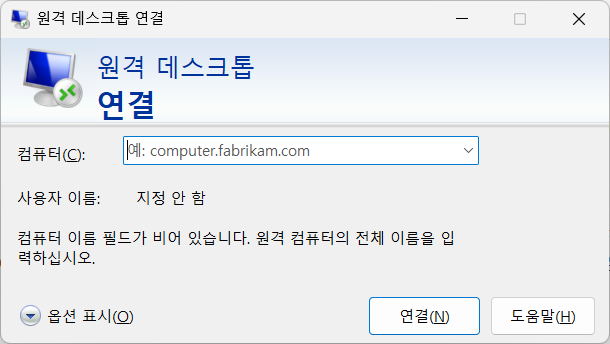

# IT환경: SSH 터널링 통한 외부 윈도우즈 PC에 원격 접속 우회 방법

윈도우즈에서는 다른 윈도우즈 설치PC로 원격접속을 할 수 있다.

로컬 윈도우즈 PC에서 외부 윈도우즈 PC로 원격 접속을 할 때, 보통 "시작" > "원격 데스크톱 연결" 검색해서 나오는 앱(아래 그림 참고) 통해서 접속하며, MS가 개발한 보안 네트워크 통신 프로토콜인 RDP(Remote Desktop Protocol) 방식으로 원격 접속을 할 수 있다.

하지만 모종의 사유(대부분 보안이겠지만)로 회사에서 집이나 다른 곳 PC로 RDP 원격 접속이 막혀있는 경우가 있는데, 구글링하다가 SSH 터널링을 통해 우회하는 방법을 찾았고, 이를 소개해 보고자 한다.

## SSH 터널링과 원격 접속 구조

본래

---
layout: page
title: SSH 터널링을 사용하여 외부 PC 에 원격 접속하기
description: 윈도우즈 PC 에서 외부 윈도우즈 PC 에 RDP 원격 접속을 하고자 할 때, SSH 터널링을 통해 방화벽 등 우회하는 방법
updated: 2024-07-02
---

## RDP 원격 접속

## 구조

어느 전문가의 [블로그](https://omoknooni.tistory.com/m/73)를 보면 SSH 터널링이 뭔지 알 수 있다.

대충 아래와 같이 로컬에서 리모트에 원격 접속하고 싶은 상황에서...

- note
> 로컬 PC --------> 리모트 PC

직접 접속이 안될 경우, SSH 서버를 사이에 하나 두어 아래처럼 SSH 서버를 경유하도록 만든 것이다. 

- note
> 로컬 PC --------> SSH 서버 ---------> 리모트 PC

그리고 SSH 서버는 로컬 PC 에게 리모트 PC 로 접근할 수 있는 경로를 알려준다. (그래서 터널링 이라는 이름이 붙은 것 같다.)

아래에는 굳이 SSH 서버를 따로 구할 필요없이, 리모트 PC 자체가 SSH 서버가 될 수 있도록 하는 방법을 기록해뒀다. 즉, 외견상으로는 로컬 PC 에서 리모트 PC 로 바로 접속하지만, 리모트 PC 안에 있는 SSH 서버에 접속하고, 이 SSH 서버가 자기 스스로에게 다시 접근하는 식이다.

## 방법

사전 설정으로 리모트 PC 에 암호를 설정해둔다.

다음으로 [MS 도움말](https://learn.microsoft.com/ko-kr/windows-server/administration/openssh/openssh_install_firstuse?tabs=gui)을 살펴보면, 중간정도에 OpenSSH 구성 요소를 설치하는 방법이 있는데, 이를 참고하여 리모트 PC (윈11) 에 OpenSSH 서버를 아래처럼 깔았다.

- note
> - "시작" -> "설정" -> "시스템" -> "선택적 기능" 선택
> - "선택적 기능 추가" 옆 "기능 보기" 버튼 클릭하여 "OpenSSH 서버" 검색...
> - 검색 결과가 나온다면 설치가 안되어있다는 의미므로, OpenSSH 서버 체크하고 "다음" 버튼을 눌러 설치... (생각보다 오래 걸림)
> - 설치 완료되었으면 재부팅
> - 재부팅 후, "시작" -> "services.msc" 검색하여 실행
> - 세무 서비스들 창에서 "OpenSSH SSH Server" 항목 더블 클릭 -> "시작 유형" 을 "자동"으로 변경 -> "시작" 버튼 클릭 -> "확인"

이제 로컬 PC 에서 아래와 같이 진행한다. (위에서 언급한 어느 전문가의 블로그를 참고했다.)

- note
> - 윈도우키 + R -> "cmd" 입력 후 엔터
> - 새로운 창이 열리면... 
> - ssh -L 8888:127.0.0.1:3389 [리모트 PC 사용자명]@[리모트 PC 원격 주소]
> - 비밀번호 입력 -> 접속 성공 시 [리모트 PC 사용자명] 프롬프트가 뜸...

이 화면을 그대로 둔 상태에서 (화면을 닫으면 안됨)...

- note
> - "시작" -> "원격 데스크톱 연결" 검색하여 실행

원격 데스크톱 연결 화면이 뜨면...

- note
> - 컴퓨터에 "127.0.0.1:8888" 입력 -> 사용자 이름까지 넣어서 원격접속 실행

👏👏👏 다행이 잘 실행되었다.

참고로 본인은 이 [포스팅](/post/install-domestic-server-with-smarphone-or-tablet)에 있는 내용을 참고하여, iptime 공유기를 가지고 [리모트 PC 원격 주소]를 xxxx.iptime.org 와 같은 형태로 만들었다. iptime 공유기로 와이파이 통해 리모트 PC 를 사용하는 사람은 참고해봐도 좋을 것이다.
